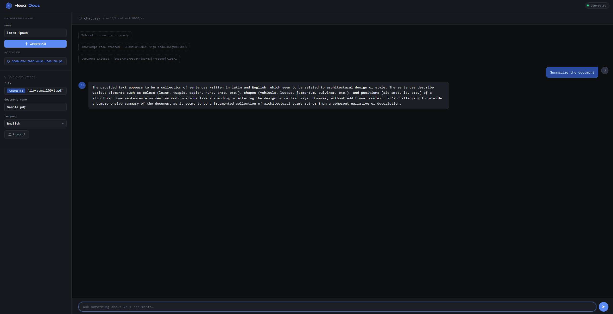

# 📚 HexaDocs

| CI Status                                                                                                                                                     | License                                                                                                                                                                                                          |
|---------------------------------------------------------------------------------------------------------------------------------------------------------------|------------------------------------------------------------------------------------------------------------------------------------------------------------------------------------------------------------------|
| [](https://github.com/hirannor/HexaDocs/actions/workflows/ci.yaml) | [](https://opensource.org/licenses/MIT) [](https://commonsclause.com/) |

---

A **domain-driven, event-driven document intelligence system** built with **Hexagonal Architecture**, designed to
support semantic document ingestion, chunking, embedding, and AI-powered retrieval (RAG).

---

## 🚀 Overview

HexaDocs is a backend system that allows users to:

- Upload documents into a **Knowledge Base**
- Automatically process and split documents into semantic chunks
- Generate embeddings for semantic search
- Store vectors in a dedicated vector store
- Enable AI-powered question answering over documents

The system is designed around **clean architecture principles**, strong domain modeling, and asynchronous event-driven
workflows.



---


## 🧠 Core Idea

Instead of treating documents as static files, HexaDocs transforms them into:

> **Structured, searchable knowledge units powered by embeddings**

Each document becomes:

- A set of semantic chunks
- Indexed

---

## 🧩 Core Capabilities

### 📄 Document Ingestion

- Upload documents (PDF)
- Extract and normalize content
- Split into chunks

### 🧠 Embeddings

- Generate embeddings using:
    - `nomic-embed-text` (Ollama)
- Store vectors in `pgvector`

### 🔎 Semantic Search (RAG)

- Query embedding generation
- Vector similarity search
- Context retrieval for LLM

### 💬 AI Chat

- Uses `mistral` via Ollama
- Context-aware answers (RAG-based)

### ⚡ Event-Driven Pipeline

- RabbitMQ-based async processing
- Decoupled ingestion and embedding pipeline

---

# 📌 Overview Flow

The system works in 3 main steps:

1. Create a Knowledge Base
2. Upload Documents into the Knowledge Base
3. Ask questions via Chat (RAG)

---

# 🧠 1. Create Knowledge Base

Create Knowledge base workspace

---

### ➤ Endpoint
POST /api/knowledge-bases

---

### ➤ Request Body
```json
{
  "name": "My Knowledge Base"
}
```

# 📄 2. Upload Document

Uploads a document into a specific Knowledge Base for processing (text extraction + embeddings).

---

## ➤ Endpoint
POST /api/documents/upload

---

## ➤ Content-Type
multipart/form-data

---

## ➤ Request Fields

| Field | Type | Required | Description |
|------|------|----------|-------------|
| file | binary (PDF) | Yes      | The document file to upload |
| name | string       | Yes      | The document name | 
| knowledgeBaseId | string (UUID) | Yes      | ID of the target knowledge base |
 | language  | string | Yes      | Language of the document | 

---

# 🧾 3. Ask Question (Chat / RAG)

Ask questions about documents stored in a Knowledge Base using semantic search (vector DB) + LLM generation.

---

## ➤ Endpoint
POST /api/chat

---

### ➤ Request Body
```json
{
  "knowledgeBaseId": "550e8400-e29b-41d4-a716-446655440000",
  "question": "My question?"
}
```

---

## 🧪 OCR (Tesseract) Setup

HexaDocs uses **Tesseract OCR** as a fallback mechanism for PDF text extraction when embedded text layers are missing or
corrupted.

### 📦 Required Installation

Tesseract must be installed on the host machine:

- Windows installer: https://github.com/UB-Mannheim/tesseract/wiki
- Linux: `sudo apt install tesseract-ocr`
- macOS: `brew install tesseract`

---

### 🌍 Language Support

By default, only English is installed.  
If you process non-English documents (e.g. Hungarian), you must install additional language packs.

Example for Hungarian:

- Download: https://github.com/tesseract-ocr/tessdata_best/blob/main/hun.traineddata

#### ⚙️ Environment Variable Configuration

Tesseract requires the `TESSDATA_PREFIX` environment variable to be set correctly.

#### Windows example:

## 🚀 Running the system

Start all services:

```bash
docker-compose up -d
```

# ⚙️ Typical Workflow via UI
1. Open http://localhost:8080
2. Create a Knowledge Base
3. Upload a PDF document
4. Wait for ingestion pipeline to process the document
5. Start chatting with your documents instantly
